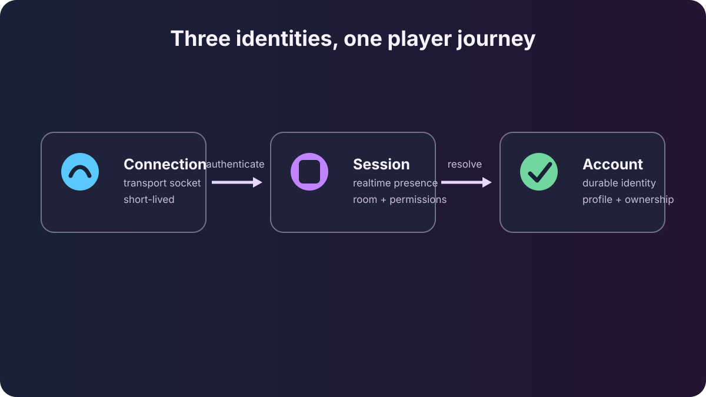

One player can have several identities at the same time. They answer different
questions, and mixing them creates subtle reconnect and security bugs.

*One hero, three identities: the connection and participant change on reconnect;
the account remains the durable player identity.*

## The three identities

| Identity | Plain-English meaning | Lifetime |
| --- | --- | --- |
| `ConnectionId` | Which socket is carrying bytes right now? | One transport connection |
| `ParticipantId` | Which live realtime participant sent this message? | One accepted connection |
| Account session + `user_id` | Which durable player account authenticated? | Across reconnects until the session expires/revokes |

The first two are local, temporary routing identities. The account is the player
identity you use for storage, friends, groups, wallet data, and other durable
services.

## Guest or authenticated player

Every realtime connection starts with `KIND_AUTH`.

- An **empty body** asks to join as a guest. This works only when the server
  allows guests. Runtime `ctx.user_id` is absent.
- A **session token** binds the new participant to the account that received the
  token from device/custom authentication. Runtime `ctx.user_id` is present.

Both paths still get a fresh `ParticipantId` for realtime sender tags.

## Login and connect, step by step

1. The client authenticates a device/custom identity over HTTP.
2. Citadel returns an access token and durable `user_id`.
3. The client opens a realtime transport.
4. The client sends the access token in its first reliable `KIND_AUTH` envelope.
5. Citadel validates the token and binds the account to a fresh participant.
6. The participant can now join rooms and call authenticated game services.

This split is intentional: HTTP creates the account session; the realtime
handshake proves that the new socket may use it.

## Reconnect without identity confusion

After a disconnect:

- the old `ConnectionId` is gone;
- the old `ParticipantId` is gone;
- room membership and live presence are gone;
- the account remains the same if the client authenticates again with a valid
  session token.

Never store durable player progress under `ParticipantId`. Store it under the
authenticated `user_id`.

## Token security in plain English

Treat a session token like a password. Keep it out of logs, send it only over an
authenticated connection, and discard it when the session ends. Its serialized
shape is an implementation detail: clients should store and return the token,
not parse it or try to recreate it from a user id.

Citadel redacts token secrets in logs and validates expiry/revocation at connect.
Invalid tokens return a deliberately vague failure so attackers cannot discover
which tokens exist. Refresh credentials rotate: after a successful refresh, save
the returned access/refresh pair and discard the old pair. A player can also
revoke a single session through the player HTTP logout endpoint.

## Current limits

- A reconnect always creates a new realtime participant.
- The current session-token index is in process, so tokens do not survive a
  server restart; the client authenticates again over HTTP.
- Connect-time validation ships. Active mid-connection expiry/revocation
  enforcement remains planned.

## Related

- [Authentication reference](/reference/client-sdk/authentication/) — exact HTTP and realtime contracts.
- [Manage a player session](/guides/manage-player-session/) — refresh, profile, known-player lookup, and logout.
- [Gateway, rooms & relay](/concepts/gateway/) — how accepted participants are routed.
- [Messages & envelopes](/concepts/envelopes/) — how sender tags travel.
