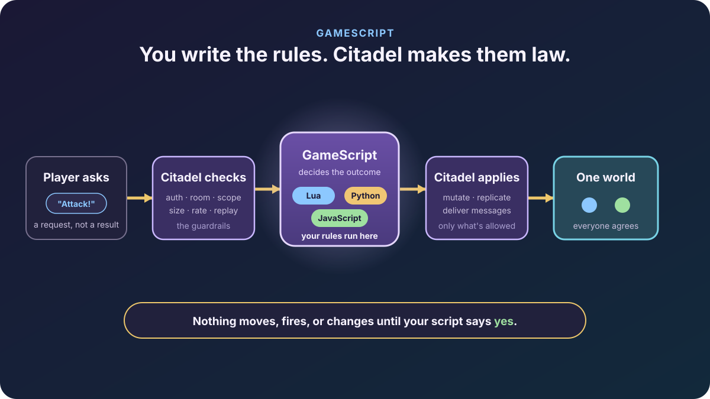

import { Card, CardGrid, Tabs, TabItem, Aside } from '@astrojs/starlight/components';


*Players propose. Your rulebook decides. Everyone lives in the same world.*

**GameScript is the part of Citadel where you write what your game *is*.**
Movement, shooting, damage, loot, cooldowns, who-can-do-what — the rules live in a
script you write in **Lua, Python, or JavaScript**, and Citadel makes that script
the final word. Players can *ask* for anything. Only your rules decide what
actually happens.

## Why this is a big deal

Multiplayer usually forces a bad trade:

- **Easy but cheatable** — let clients change the world directly. Fast to build,
  but the first hacker ruins it for everyone.
- **Safe but painful** — run everything on an authoritative server, but now you
  write your whole game in the server's language and rebuild to change a number.

GameScript refuses the trade. You get the **easy** part (write rules in a language
you already like, and hot-reload them) *and* the **safe** part (the server is the
authority, so cheating is off the table). That combination is Citadel's signature
move.

## How it works, in five beats



1. **A player asks.** "I moved here." "I fired." It's a *request*, never a result.
2. **Citadel checks the basics.** Is this really that player? Right match? Not
   spammy or malformed? The boring-but-vital guardrails.
3. **GameScript decides.** Your script sees a clean, verified event and says
   **accept**, **reject**, or **correct** — and can fire off messages, spawns, or
   damage as it does.
4. **Citadel applies only what you allowed.** It changes state and tells the other
   players — and nothing else.
5. **Everyone sees one world.** Same result, every screen.

<Aside type="tip" title="The one promise">
Nothing moves, fires, or changes until your script says **yes**. If your script is
missing, crashes, or times out, the safe default is *do nothing* — never "let it
through."
</Aside>

## Who does what

<CardGrid>
	<Card title="Your GameScript owns the fun" icon="rocket">
		Movement rules, hit outcomes, damage and death, cooldowns and stamina,
		spawns, loot, win conditions, replicated gameplay variables, and any custom
		message your game invents.
	</Card>
	<Card title="Citadel owns the plumbing" icon="setting">
		Connections, authentication, matches and matchmaking, ownership and scope,
		size/rate limits, replay protection, persistence, and actually delivering
		messages to the right players.
	</Card>
</CardGrid>

You write the *what*. Citadel handles the *how* and the *is-this-even-allowed*.

## Same story, three languages

Pick the language you're happiest in. The one handler — `citadel.on_input` — looks
the same in all three shipped runtimes. Here it is turning away a classic speed
hack and letting everything else through:

<Tabs syncKey="engine">
<TabItem label="Lua">
```lua
citadel.on_input(function(event)
  if event.kind == "transform_input" and event.move_velocity.x > 2000 then
    return { decision = "reject", reason_code = 1 }  -- nice try, speedster
  end
  return nil  -- accept: the server integrates the move for real
end)
```
</TabItem>
<TabItem label="JavaScript">
```javascript
citadel.on_input((event) => {
  if (event.kind === "transform_input" && event.move_velocity[0] > 2000) {
    return { decision: "reject", reason_code: 1 };  // nice try, speedster
  }
  return undefined;  // accept
});
```
</TabItem>
<TabItem label="Python">
```python
import citadel

def on_input(event):
    if event["kind"] == "transform_input" and event["move_velocity"][0] > 2000:
        return {"decision": "reject", "reason_code": 1}  # nice try, speedster
    return None  # accept

citadel.on_input(on_input)
```
</TabItem>
</Tabs>

Want the server to own hit detection but let *you* decide the damage? Fire a
`citadel.rewind_query` for lag-compensated hits, then choose the consequence — the
[authoritative gameplay bridge reference](/reference/server-sdk/authoritative-gameplay-bridge/)
has the full surface.

## Cheating is off the table

Because the server is the authority, the usual exploits just… don't work:

- **No client shortcuts.** A hacked client can spoof packets all day; they're only
  *requests*, and your script sees a verified event before deciding.
- **All-or-nothing answers.** Your script's reply is fenced — stamped with match,
  tick, and version — and applied whole or not at all. No half-applied exploits, no
  stale or cross-match replies sneaking in.
- **Fail-closed, always.** Timeout, crash, or a bad reply closes *that one match*
  safely and sends its players back to matchmaking — it never falls back to trusting
  the client.
- **One noisy match can't hurt the others.** Each match runs isolated inside a
  supervised worker.

## Easy to start, powerful when you're ready

<CardGrid>
	<Card title="Prototype in minutes" icon="puzzle">
		Start in **relay mode** (the default): open the demo, move in one tab, watch
		the other tab update. No rules to write yet — just see multiplayer work.
	</Card>
	<Card title="Flip on authority when it counts" icon="approve-check">
		Set `runtime.require_script = true` and every protected action now flows
		through your script. Same game, now cheat-proof.
	</Card>
</CardGrid>

## Your next quest

- **See it move:** [Getting started](/quickstart/) runs a server and a browser demo.
- **Build a real loop:** [Knights vs Monsters](/tutorials/knights-vs-monsters/).
- **Go deep on the model:** [Game logic & server authority](/concepts/game-logic/).
- **Exact API:** [Lua](/reference/server-sdk/lua-runtime/) ·
  [Python](/reference/server-sdk/python-runtime/) ·
  [JavaScript](/reference/server-sdk/js-runtime/) ·
  [Authoritative gameplay bridge](/reference/server-sdk/authoritative-gameplay-bridge/).
