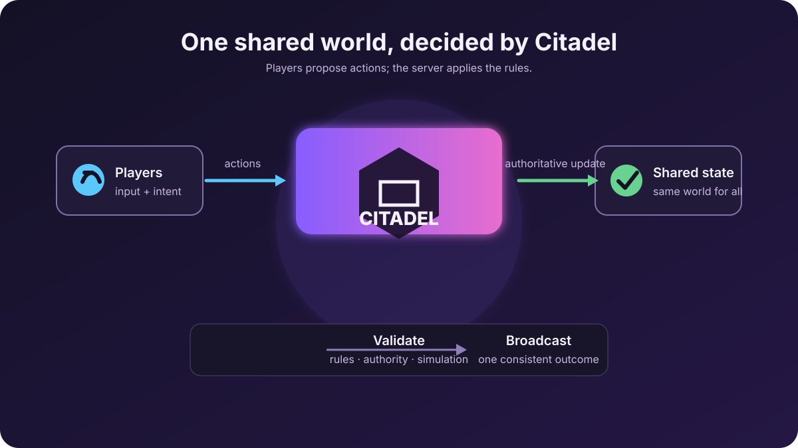

import { Card, CardGrid } from '@astrojs/starlight/components';

*Players propose actions. Citadel applies the rules and returns one shared world.*

## Start with a win

You do not need to understand networking theory before seeing Citadel work.
The first quest is intentionally small:

<CardGrid stagger>
	<Card title="1. Run Citadel" icon="rocket">
		One command builds the server, starts the local game backend, and serves a
		browser demo.
	</Card>
	<Card title="2. Open two players" icon="laptop">
		Open two browser tabs. Each tab joins as a guest and gets its own realtime
		participant.
	</Card>
	<Card title="3. Move the shared world" icon="approve-check">
		Move in one tab. The other tab receives the update and renders the peer.
		That is your first multiplayer loop.
	</Card>
</CardGrid>

[Take the quickstart →](/quickstart/)

## Choose your first quest

<CardGrid>
	<Card title="I want a tiny online game" icon="puzzle">
		Build **Knights vs Monsters**. You will write server rules, connect a client,
		validate attacks, and share monster state.

		[Start the tutorial →](/tutorials/knights-vs-monsters/)
	</Card>
	<Card title="I already use a game engine" icon="puzzle">
		Install the Unity, Unreal, or Godot SDK and connect your existing project to
		Citadel.

		[Choose an engine →](/guides/install-client-sdk/)
	</Card>
	<Card title="I build for the web" icon="laptop">
		Use `@citadel/client` over WebSocket and keep rendering in your own Three.js
		or browser app.

		[Connect a web game →](/guides/web-client/)
	</Card>
	<Card title="I write the server rules" icon="rocket">
		Start with Lua, or enable embedded Python or JavaScript. All three follow one
		language-neutral host contract; the runtime reference calls out scoped gaps.

		[Meet the runtime guild →](/concepts/game-logic/)
	</Card>
</CardGrid>

## Meet the cast

Every Citadel game has three clear roles:

- **The game client** owns input, cameras, animation, sound, and immediate visual
  feedback.
- **Citadel** owns connections, identity, rooms, routing, persistence, and the
  services that players share.
- **Your game logic** decides what is allowed: movement limits, damage, rewards,
  spawns, match rules, and any other server-owned truth.

That separation is the core idea behind the whole documentation. Learn it once,
then reuse it in Unity, Unreal, Godot, Rust, or the web.

## What exists today

Citadel already ships device/custom authentication, authenticated realtime
connections, named rooms, single-node authoritative matches and presence,
storage, friends, groups, durable chat history, leaderboards, a durable
notification inbox with local live delivery, wallet services, operator APIs,
and client surfaces for Unity, Unreal, Godot, Rust, and the web. Lua ships by
default; Python and capped JavaScript runtimes are feature-gated.

Some arcs are still in progress: cross-node authoritative match ownership,
live chat fan-out and typing, hardened WASM game logic, full Node/TypeScript
hosting, Rust-as-a-crate game logic, and a few platform/package ergonomics.

:::tip[The honest status screen]
The docs label planned work instead of pretending it ships. For the exhaustive,
generated view, check the repository's
[Feature status matrix](../../../../../README.md#feature-status).
:::

## Read this site without getting lost

- **Start here** gives you a working server and a playable tutorial.
- **Concepts** build the mental model in plain English.
- **Guides** complete one real workflow at a time.
- **Reference** gives exact methods, parameters, errors, configuration, and wire
  layouts when you need precision.
